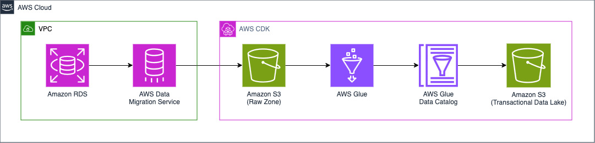
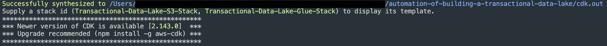
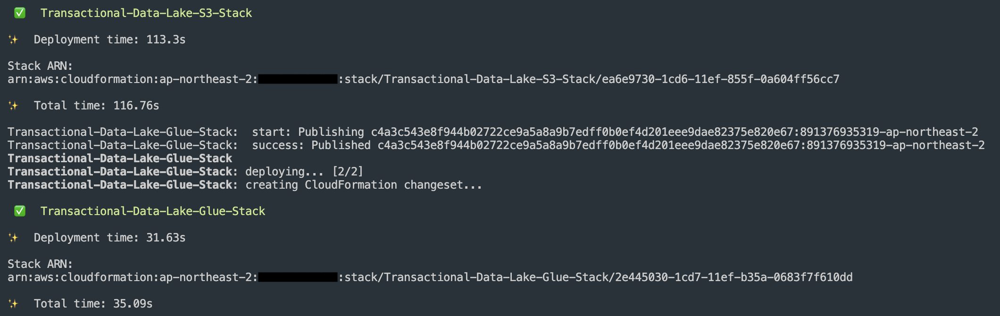
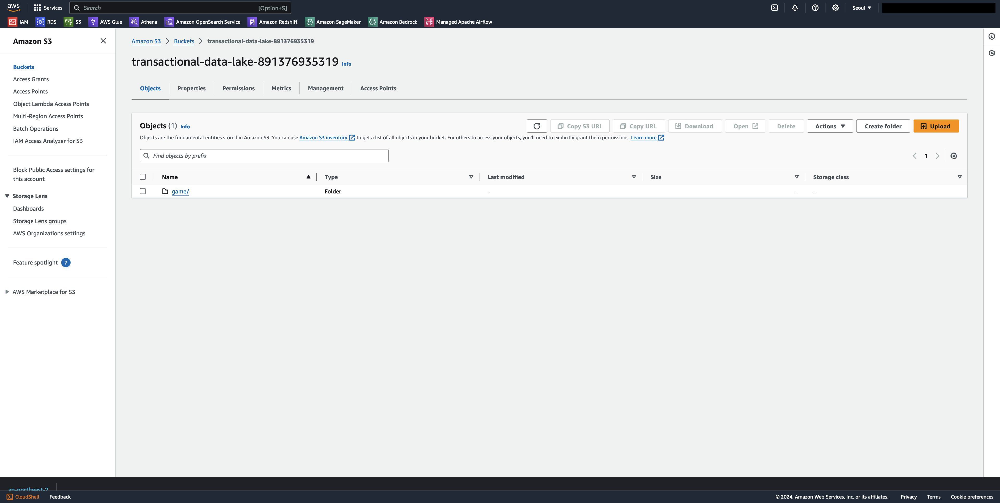
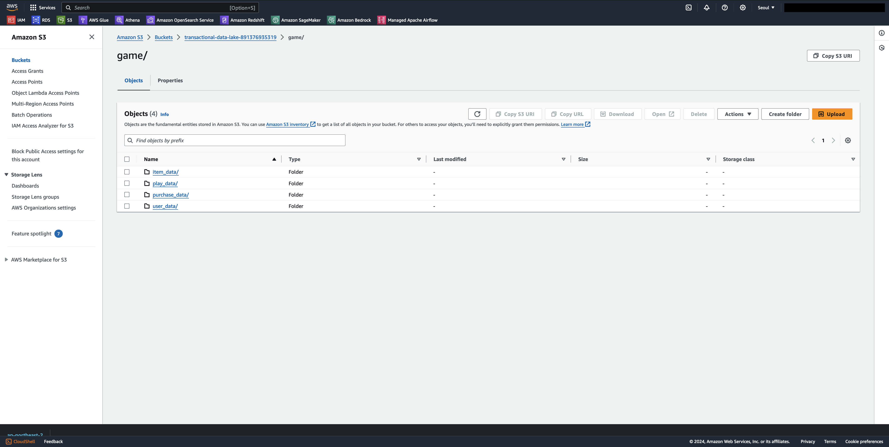
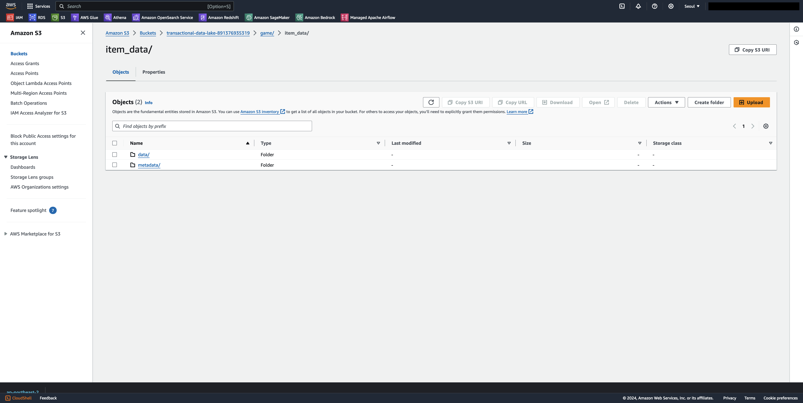
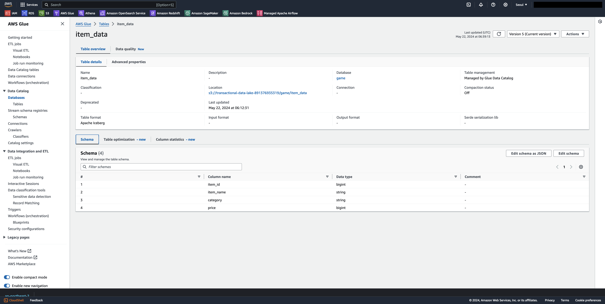
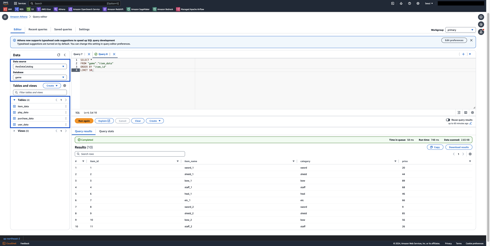
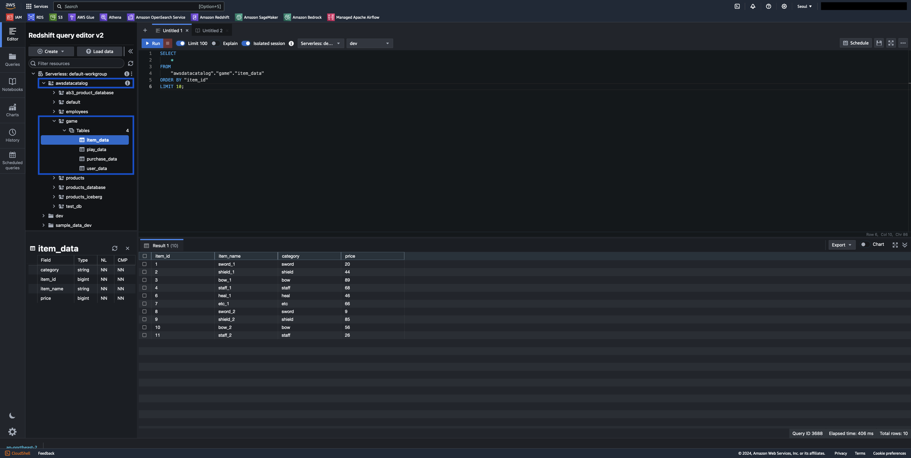

## Automation of Building a Transactional Data Lake
1. [Introduction](https://github.com/aws-samples/automation-of-building-a-transactional-data-lake/tree/main?tab=readme-ov-file#introduction)
2. [Guide Overview](https://github.com/aws-samples/automation-of-building-a-transactional-data-lake/tree/main?tab=readme-ov-file#guide-overview)
3. [How to Run](https://github.com/aws-samples/automation-of-building-a-transactional-data-lake/tree/main?tab=readme-ov-file#how-to-run)
4. [Reference Link](https://github.com/aws-samples/automation-of-building-a-transactional-data-lake/tree/main?tab=readme-ov-file#reference-link)
<br>

## Introduction
This guide provides a simple and deployable use case for automating the process of building a transactional data lake on the AWS environment. With this guide, you will configure the parameters of AWS Glue, including choosing an open table format among Apache Hudi, Apache Iceberg, and Delta Lake. Once the parameters are configured, you will deploy this guide on your AWS environment and initiate the automated process of building a transactional data lake using the chosen open table format.
<br>
<br>
## Guide Overview
#### Background
Many customers are interested in building a transactional data lakses with open table formats such as Apache Hudi, Apache Iceberg, Delta Lake on the AWS environment. This approach helps overcome the limitations of a traditional data lakes. However, when building a transactional data lake on AWS environment, customers may face the following challenges:

- Difficulty in choose an open table format that fits their functional requirements and supports integrations with other AWS services
- Significant learning curve and development overhead associated with building a transactional data lake

This guide aims to mitigate the above challenges that you may encounter. We encourage you to use this guide as a high-level guidance which can help you to understand how a transactional data lake is built on AWS environment with each open table formats, and eventually to identify what open table format is likely a good fit for your use case. 

#### Proposed Guide
<!--[Image] Architecture Diagram-->


The focus area of the guide is to help customers understand how to build a transactional data lake with their preferred open table format. To simplify the guide and save costs, we make the following assumptions:

* We have one database named ```game``` and four tables named ```item_data```, ```play_data```, ```purchase_data``` and ```user_data``` under this database in Amazon RDS.
* The tables stored in Amazon RDS were migrated into Amazon S3 (Raw Zone)‘s ```initial-load``` folder by the initial (full-load) replication task of Amazon DMS.
* Ongoing changes in tables stored in Amazon RDS, after initial (full-load) replication task, have been captured and migrated into Amazon S3 (Raw Zone)‘s ```cdc-load``` folder by the ongoing replication task of Amazon DMS.

The folder structure of Amazon S3 (Raw Zone) will be as follows:
```
.
├── cdc-load
│   └── game
│       ├── item_data
│       ├── play_data
│       ├── purchase_data
│       └── user_data
└── initial-load
    └── game
        ├── item_data
        ├── play_data
        ├── purchase_data
        └── user_data
```

With the above assumptions, the guide will only provision the cloud resources enclosed with AWS CDK box on the above architecture diagram image as default.
However, if you choose Delta Lake as the open table format, more cloud resources need to be provisioned compared to when you choose Apache Hudi and Apache Iceberg, for the following reasons:

- **AWS Glue Data Catalog Update**: AWS Glue currently does not support Data Catalog update option with Delta Lake, which means that a crawler has to be additionally created.
- **Integration with Amazon Redshift**: Amazon Redshift currently requires additional metastore storing  symlink-based manifest table definitions to query Delta Lake tables.

This guide will set up the following cloud resources when you choose **Apache Hudi** or **Apache Iceberg**:
|Resource|Description|
|--|--|
|S3 Bucket(1)|Object Storage for Raw Data Lake|
|S3 Bucket(2)|Object Storage for Transactional Data Lake|
|Glue ETL Job(1)|PySpark Job for creating tables in Glue Data Catalog and S3 Bucket(2) with initial data|
|Glue ETL Job(2)|PySpark Job for updating tables in S3 Bucket(2) with CDC data|
|Glue Data Catalog|Metastore for table definition|

This guide will set up the following resources when you choose **Delta Lake**:
|Resource|Description|
|--|--|
|S3 Bucket(1)|Object Storage for Raw Data Lake|
|S3 Bucket(2)|Object Storage for Transactional Data Lake|
|Glue ETL Job(1)|PySpark Job for creating tables in S3 Bucket(2) with initial data|
|Glue ETL Job(2)|PySpark Job for updating tables in S3 Bucket(2) with CDC data|
|Glue Data Catalog(1)|Metastore for table definition|
|Glue Data Catalog(2)|Metastore for symlink-based manifest table definition|
|Glue Crawler(1)|Classifier for creating table definition in Glue Data Catalog(1) after Glue ETL Job(1) is complete|
|Glue Crawler(2)|Classifier for creating symlink-based manifest table definition in Glue Data Catalog(1) after Glue ETL Job(1) is complete|
<br>

## How to Run
Now you will provision the cloud infrastructures using the AWS Cloud Development Kit (AWS CDK).

#### 1. Clone repository and install Python dependencies
Open your terminal, and run the following commands in the specified order:
```
git clone https://github.com/aws-samples/automation-of-building-a-transactional-data-lake.git

cd automation-of-building-a-transactional-data-lake

# [Mac Only] Create virtual environment
python -m venv .venv

# [Mac Only] Activate virtual environment
source .venv/bin/Activate

python -m pip install -r requirements.txt
```

#### 2. Bootstrap CDK
In this section, you will set-up the resources required by CDK to deploy into the AWS account. This step is only required if you have not used CDK in the deployment account and region. On your terminal, run the following command:
```
cdk bootstrap
```

#### 3. Set up the parameters of AWS Glue
In this section, you will set up the parameters of AWS Glue. Go to cdk.json file, and set up the following parameters:
|Parameter|Value|
|--|--|
|glue_assets_bucket_name|aws-glue-assets-*{your-aws-account}*|
|raw_data_lake_bucket_name|raw-data-lake-*{your-aws-account}*|
|transactional_data_lake_bucket_name|transactional-data-lake-*{your-aws-account}*|
|open_table_format|hudi, iceberg, delta (choose one)|
|schedule_of_glue_trigger_for_cdc_etl|*cron expression*|

Before moving forward, make sure the following:
- Amazon S3 bucket name must be unique across all AWS accounts in all the AWS Regions.

- The value of open_table_format must be one of "hudi", "iceberg", or "delta" (without any variations like 'Hudi' or 'Apache Hudi', as these will lead to an error).

- The value of ```schedule_of_glue_trigger_for_cdc_etl``` must follow [Unix-like cron syntax](https://docs.aws.amazon.com/glue/latest/dg/monitor-data-warehouse-schedule.html#CronExpressions).

- All values of the parameters must be enclosed with double quotes.

- cdk.json file must be saved after setting up the parameters.


#### 4. Deploy CDK Stacks
In this section, you will synthesize and eventually deploy CDK stacks.

Go back to your terminal and run the following command:
```
# Sythesize CDK stacks into CloudFormation template
cdk synth --all

# Deploy CDK stacks
cdk deploy --all --require-approval never
```
If you successfully synthesize your CDK stacks, you can see like the below on your terminal:
<!--Screenshot of the terminal after cdk synth-->


If you successfully deploy your CDK stacks, you can ses like the below on your terminal:
<!--Screenshot of the terminal after cdk deploy-->


#### 5. Run Glue ETL Job with initial-load data
In this section, you will run Glue ETL Job(1), which is responsible for creating tables in S3 Bucket, using open table format you have chosen.

If you have chosen either **Apache Hudi** or **Apache Iceberg** in step 3, run the following command:
```
aws glue start-job-run --job-name "initial-glue-etl-job"
```

If you have chosen **Delta Lake** in step 3, run the following command:
```
aws glue start-trigger --name "glue_trigger_for_initial_load"

```

#### 6. Check the Results
To verify that the guide is working correctly, you can perform the following activities: 
- **Amazon S3 Bucket (Transactional Data Lake)**: Check if the table data has been loaded into the Amazon S3 bucket serving as the Transactional Data Lake.




- **AWS Glue Data Catalog**: Verify that the table definitions have been written to the AWS Glue Data Catalog.


- **Amazon Athena**: Run queries in Amazon Athena to read and validate the table data.


- **Amazon Redshift**: Run queries in Amazon Redshift to read and validate the table data.

<br>

## Reference Link
[1] [Choosing an open table format for your transactional data lake](https://aws.amazon.com/blogs/big-data/choosing-an-open-table-format-for-your-transactional-data-lake-on-aws/)
</div>


## Security

See [CONTRIBUTING](CONTRIBUTING.md#security-issue-notifications) for more information.

## License

This library is licensed under the MIT-0 License. See the LICENSE file.

